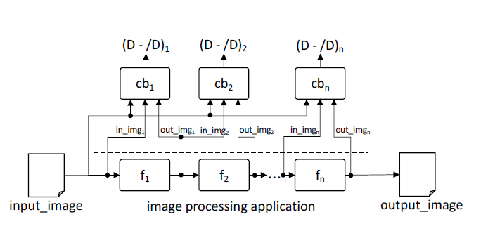
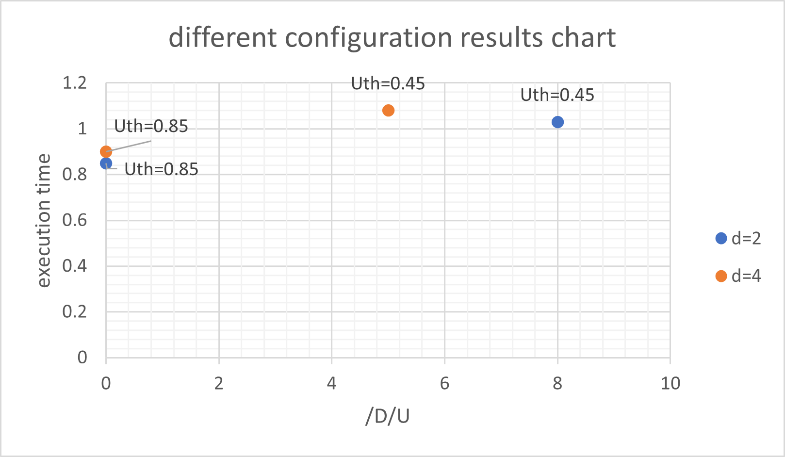

# Approximation-based Fault Tolerance in Image Processing

[](https://www.python.org/)
[](https://tensorflow.org/)
[]()

## 📌 Abstract
This project implements a lightweight fault tolerance mechanism for image processing applications, inspired by the work of *Biasielli et al.* (IEEE).

Traditional reliability methods, such as **Duplication With Comparison (DWC)**, impose a **100% overhead** by requiring exact bit-wise matches. This is often overly strict for image processing tasks where human vision tolerates minor errors. 

**Our Solution:** We replace the exact redundant copy with a **CNN-based Approximation Checker**. This allows the system to distinguish between *usable* and *unusable* images based on a flexible threshold, significantly reducing re-execution costs.

## 🛠️ System Architecture
The core innovation is the parallel execution of the main task and a lightweight Neural Network.


*Figure 1: High-level block diagram. The input image is processed by the Main Filter and the CNN Predictor simultaneously. The Decision Block compares their outputs against the Usability Threshold ($U_{th}$).*

### CNN Model Design
To ensure the overhead remains low, we designed a shallow CNN architecture optimized for fast inference rather than deep feature extraction.


*Figure 2: The lightweight CNN architecture used as the "Checker". It consists of minimal convolutional layers to approximate the main filter's output with low latency.*

## 📊 Experimental Results
We evaluated the system's performance by injecting random bit-flip faults ($d$) and varying the usability threshold ($U_{th}$).

As shown in the chart below, our method achieves a significant reduction in execution time compared to the DWC baseline, especially when the usability threshold allows for more flexibility ($U_{th}=0.85$).


*Figure 3: Average execution time (ms) comparison. The proposed method (bars on the right) demonstrates up to 30% speedup compared to the DWC baseline (left).*

### Key Performance Metrics
| Configuration | Speedup vs DWC | False Negative Rate |
| :--- | :---: | :---: |
| **DWC (Baseline)** | - | 0% |
| **Our Method ($U_{th}=0.45$)** | ~15% | < 2% |
| **Our Method ($U_{th}=0.85$)** | **~30%** | < 4% |

## 📄 Full Documentation
For a deep dive into the mathematical proofs, fault injection models, and the complete Persian report, please refer to the document below:

👉 **[Download Full Project Report (PDF)](docs/Final_Report_Persian.pdf)**

## 💻 Installation & Usage

1. **Clone the repository:**
   ```bash
   git clone [https://github.com/hediehmr/Fault-Tolerance-Image-Processing.git](https://github.com/hediehmr/Fault-Tolerance-Image-Processing.git)
   cd Fault-Tolerance-Image-Processing
